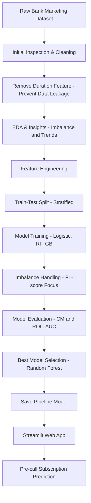
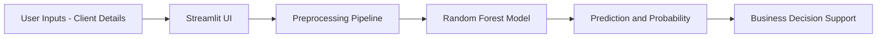

---

# 🏦 Predicting Term Deposit Subscription

A **Streamlit-based Machine Learning application** that predicts whether a bank client is likely to subscribe to a **term deposit before a marketing call is made**.
The project follows a complete **end-to-end data science workflow**, from data cleaning and exploratory analysis to deployment, with strong emphasis on **data leakage prevention**, **class imbalance handling**, and **business interpretability**.

---

## 📌 Project Title

**Predicting Term Deposit Subscription: A Streamlit-based ML App**

---

## 🎯 Domain

* Banking & Financial Services
* Direct Marketing / Telemarketing Campaign Analytics

---

## 🧩 Problem Statement

A Portuguese banking institution conducts direct marketing campaigns via phone calls to promote term deposit products. Only a small percentage of contacted clients subscribe, making campaigns costly and inefficient.

### Objective

Build a machine learning model that predicts whether a client will subscribe to a term deposit (**yes / no**) **before making a call**, and deploy it as an interactive Streamlit web application to support smarter marketing decisions.

---

## 💼 Business Use Cases

1️⃣ **Targeted Marketing Campaigns**
Focus marketing efforts on high-probability clients to improve conversion rates.

2️⃣ **Cost Reduction in Telemarketing**
Reduce unnecessary calls to low-probability customers, saving time and operational costs.

3️⃣ **Improved Customer Experience**
Avoid repeated or irrelevant calls to uninterested customers.

4️⃣ **Campaign Performance Optimization**
Identify factors influencing successful subscriptions to design better future campaigns.

5️⃣ **Personalized Financial Product Recommendations**
Extend the model for cross-selling and upselling strategies.

---

## 🧠 Skills Takeaway

* Data Understanding & Domain Insight
* Data Cleaning & Preprocessing
* Exploratory Data Analysis (EDA)
* Feature Engineering
* Handling Class Imbalance
* Machine Learning Modeling
* Model Evaluation & Selection
* Model Deployment
* Streamlit App Development
* Version Control & Documentation
* Communication & Viva Presentation

---

## 📂 Dataset

**Dataset Name:** Bank Marketing Dataset (Portugal)
**File Used:** `bank-additional-full.csv`

### 🔢 Input Features

* **age** – Client age
* **job** – Job type
* **marital** – Marital status
* **education** – Education level
* **default** – Credit default
* **balance** – Average yearly balance
* **housing** – Housing loan
* **loan** – Personal loan
* **contact** – Contact type
* **day** – Last contact day
* **month** – Last contact month
* **campaign** – Number of contacts during campaign
* **pdays** – Days since last contact (`-1` = never contacted)
* **previous** – Number of previous contacts
* **poutcome** – Outcome of previous campaign

### 🎯 Target Variable

* **y** – Term deposit subscription (`yes` / `no`)

---

## 🚨 Data Leakage Prevention

The `duration` feature is intentionally excluded because it is only known **after a marketing call ends**.
Including it would introduce **data leakage**, causing unrealistically high performance and making the model unsuitable for **pre-call prediction**.

---

## 🔎 Exploratory Data Analysis (EDA)

### Key Insights

* Strong **class imbalance**
* Higher subscription among **40–65 age group**
* **Retired, management, technician** roles convert better
* Higher **account balance → higher subscription**
* **Cellular contact** outperforms telephone
* Best results at **1–2 campaign calls**
* **Previous campaign success** is the strongest predictor

### Visualizations Used

* Count plots
* Histograms
* Box plots
* Bar charts
* Correlation heatmaps

---

## 🛠️ Approach & Methodology

1. **Problem Understanding**
2. **Data Collection & Inspection**
3. **Data Preprocessing** (remove leakage, encoding, cleaning)
4. **Feature Engineering**
5. **Stratified Train–Test Split**
6. **Model Training** (Logistic Regression, Random Forest, Gradient Boosting)
7. **Class Imbalance Handling**
8. **Model Evaluation**
9. **Model Selection**
10. **Pipeline Saving (`joblib`)**
11. **Streamlit Deployment**

---

## 🔄 End-to-End Machine Learning Workflow



---

## 📊 Model Performance

* **Model:** Random Forest Classifier
* **Accuracy:** ~90%
* **F1-score:** ~0.79
* **Focus:** Minority class (Subscribers)

---

## ⚖️ Why F1-Score Was Prioritized

The dataset is highly imbalanced.
Accuracy alone can be misleading as it favors the majority class.

**F1-score** balances **precision and recall**, ensuring reliable performance on actual subscribers.

---

## 🌐 Streamlit Application Features

* Pre-call prediction (no data leakage)
* Real-time client input
* Probability-based confidence output
* Transparent input preview
* Professional dashboard layout

### 🏗️ Streamlit App Architecture



---

## 📦 Project Deliverables

* ✅ Cleaned Dataset
* ✅ EDA Notebook
* ✅ Model Training Notebook
* ✅ Trained Model (`.pkl` / `.joblib`)
* ✅ Streamlit App
* ✅ README
* ✅ GitHub Repository

---

## 🚀 How to Run the Project

```bash
pip install -r requirements.txt
streamlit run app.py
```

---

## 👨‍💻 Author

**Sree V G**
Data Science & Analytics Enthusiast

---

## 🏁 Final Summary

This project demonstrates a **production-ready machine learning solution** for banking marketing optimization.
It combines **robust preprocessing, insightful EDA, imbalance-aware modeling, and an interactive Streamlit interface** to support smarter and cost-effective decision-making.

**Data-driven decisions for smarter banking. 🚀**

---
